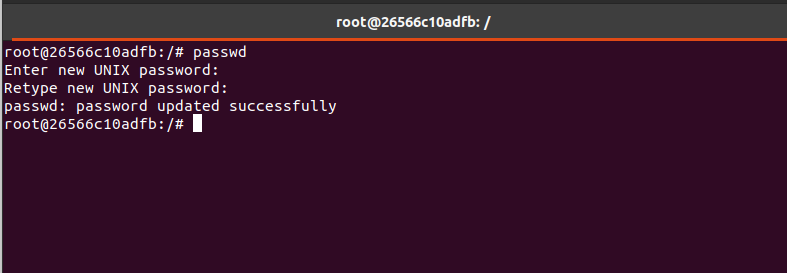
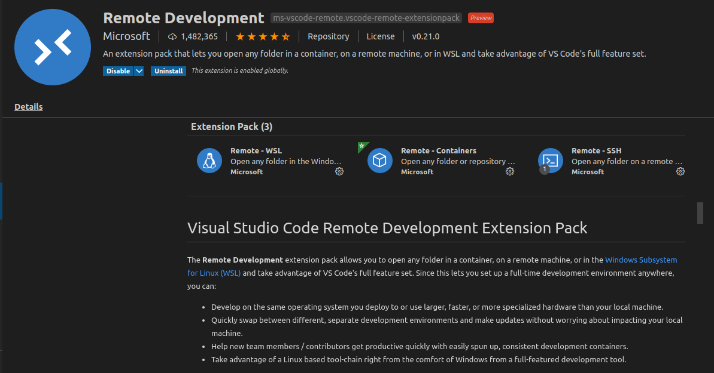
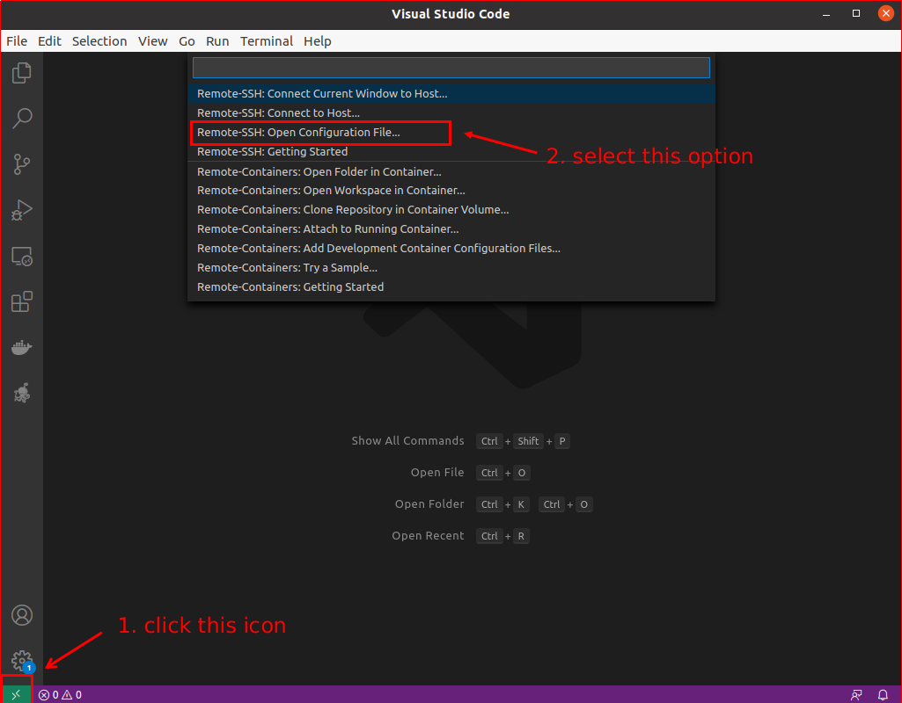
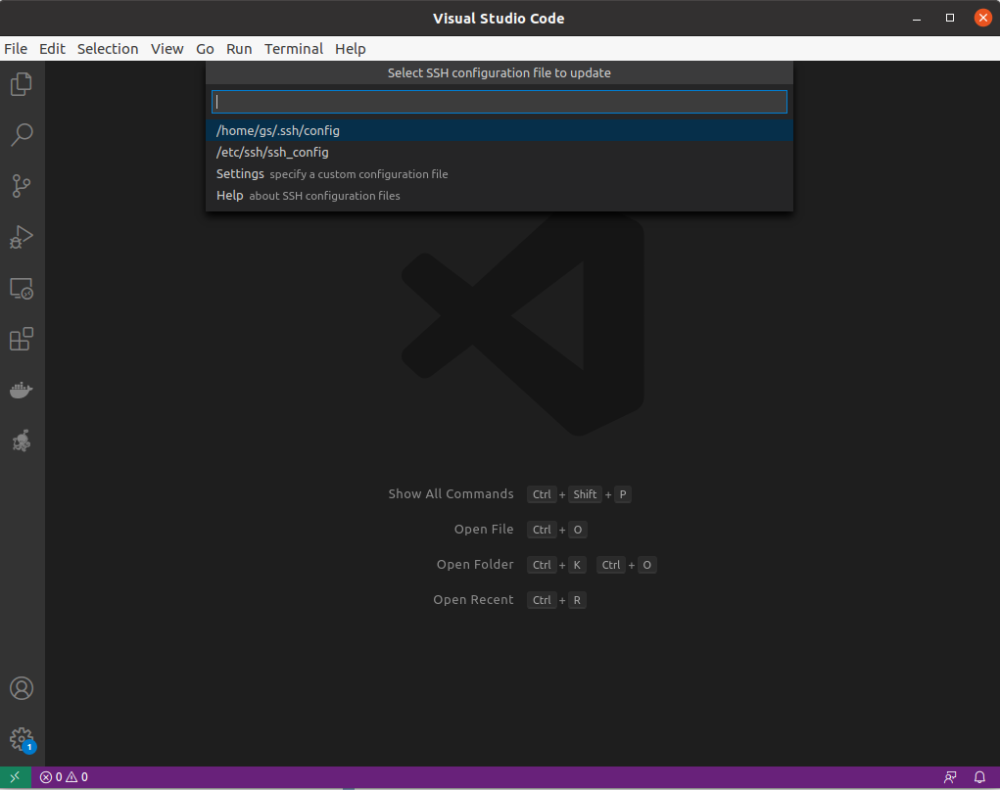
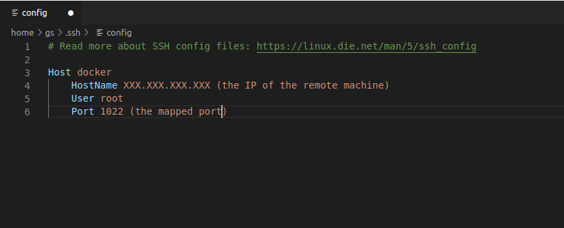
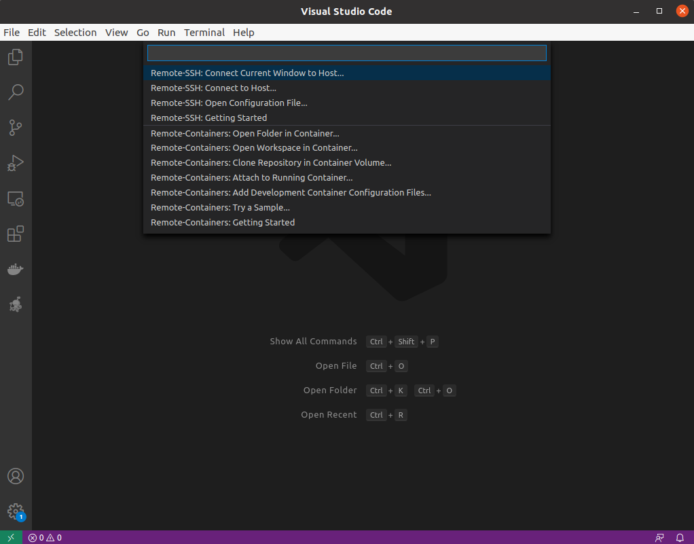
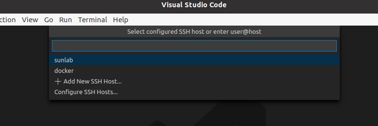
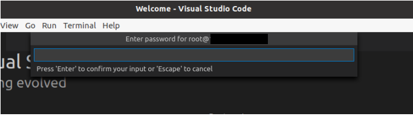
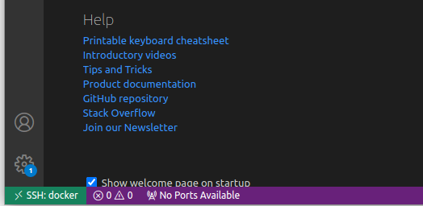
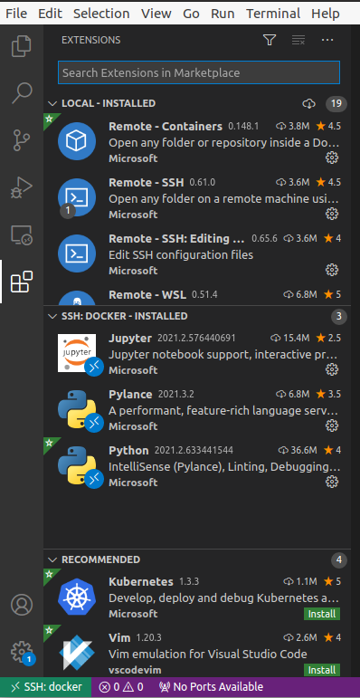

# VScode Connects to remote Docker over SSH
We assume that you have successfully installed Docker engine in the remote machine. You need to know the basic knowledge about docker.     
In gerenal, we first configure SSH service in docker container and then use the VScode Remote-SSH Extension to connect to the docker container.    
## Step 1 Configure SSH service in docker container:   
1. First connect to the remote machine. Refer to the Dockerfile of this repo, and create your own Dockerfile in a folder, for example ```/docker```.     
The provided Dockerfile will configure the SSH service in docker container automatically.    
In Dockerfile, we install the ```openssh-server``` with the below command:     
```
RUN DEBIAN_FRONTEND=noninteractive apt-get install -y openssh-server    
```     
Then, we modify ```/etc/ssh/sshd_config``` by setting ```UsePAM no``` and ```PermitRootLogin yes```:    
``` 
RUN \    
  sed -i "s/UsePAM yes/#UsePAM yes/" /etc/ssh/sshd_config && \
  sed -i "s/PermitRootLogin/#PermitRootLogin/" /etc/ssh/sshd_config && \
  echo 'PermitRootLogin yes' >> /etc/ssh/sshd_config && \
  echo 'UsePAM no' >> /etc/ssh/sshd_config 
```
Finally, we echo a command to ```/etc/bash.bashrc``` to start the SSH service when we open a bash:   
``` 
RUN echo 'service ssh start' >> /etc/bash.bashrc
```   

2.  Enter in the folder that includes the Dockerfile and build a docker image in a termintal as follow:   
```
$ cd ~/docker
$ docker build -t docker_image .
```    
3. Then create a docker container with ```docker_image``` and map the port 22 of this container to the other port of the remote machine with ```-p xxxx:22 ```:     
```
$ docker run -it --shm-size 8G -p 1234:6006 -p 1022:22 --ipc host --name docker_container --gpus all -v ~/your_project:/workspace docker_image  /bin/bash   
$ (currently, you should be in the docker container as root)
```     
4. Set a password for SSH connection, type ```passwd``` in the terminal and enter your password twice.      
     
Now we have finished the configuration of the  SSH service in container.    

## Step 2 Connect to the docker container with VScode:     
1. Open VScode as a ```New Window```. Then, click the Extensions. Search and install extenion Remote Development. This extension set consists of the Remote-SSH and other remote extensions:    
    


2. Choose the the ```Remote-SSH: Open configuration file``` and open the ```/xxx/.ssh/config``` file as the following figure:    
       
     


3. Edit the ```config``` file as figure:   
     


4. Click the left bottom icon again and select ```Remote-SSH:Connect Current Window to Host```. Then choose the Hostname that you wrote in the config file:        
     
    


5. Enter the password you set for container root:      
    


6. Now you have connected to the remote docker successfully. Install extensions in SSH:docker and enjoy your coding in remote docker.    
    
     
      
Note: Remember that the container should be always started first when we connect it with VScode.
